# Compression-Aware One-Step Diffusion Model for JPEG Artifact Removal

[Jinpei Guo](https://jp-guo.github.io/), [Zheng Chen](https://zhengchen1999.github.io/), Wenbo Li,  Yong Guo, and [Yulun Zhang](http://yulunzhang.com/),  "Compression-Aware One-Step Diffusion Model for JPEG Artifact Removal", 2024

[[paper]()] [[supplementary material]()]

#### 🔥🔥🔥 News

- **2025-02-14:** This repo is released.

---

> **Abstract:** Diffusion models have demonstrated remarkable success in image restoration tasks. However, their multi-step denoising process introduces significant computational overhead, limiting their practical deployment. Furthermore, existing methods struggle to effectively remove severe JPEG artifact, especially in highly compressed images. To address these challenges, we propose CODiff, a compression-aware one-step diffusion model for JPEG artifact removal. The core of CODiff is the compression-aware visual embedder (CaVE), which extracts and leverages JPEG compression priors to guide the diffusion model. Moreover, We propose a dual learning strategy for CaVE, which combines explicit and implicit learning. Specifically, explicit learning enforces a quality prediction objective to differentiate low-quality images with different compression levels. Implicit learning employs a reconstruction objective that enhances the model's generalization. This dual learning allows for a deeper and more comprehensive understanding of JPEG compression. Experimental results demonstrate that CODiff surpasses recent leading methods in both quantitative and visual quality metrics.

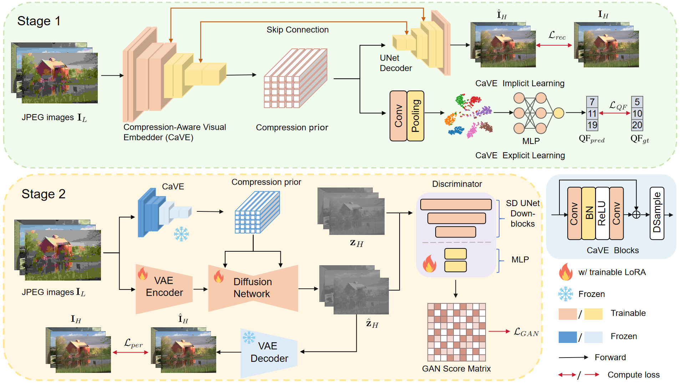

---

<!--  -->

[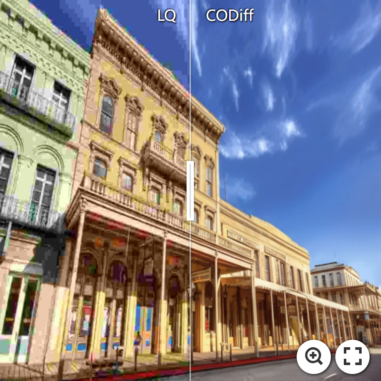](https://imgsli.com/MzQ5Mjkz) [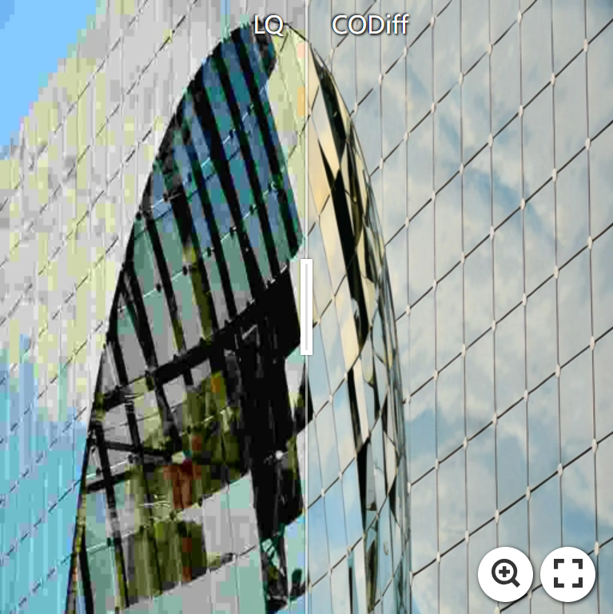](https://imgsli.com/MzQ5MzEy) [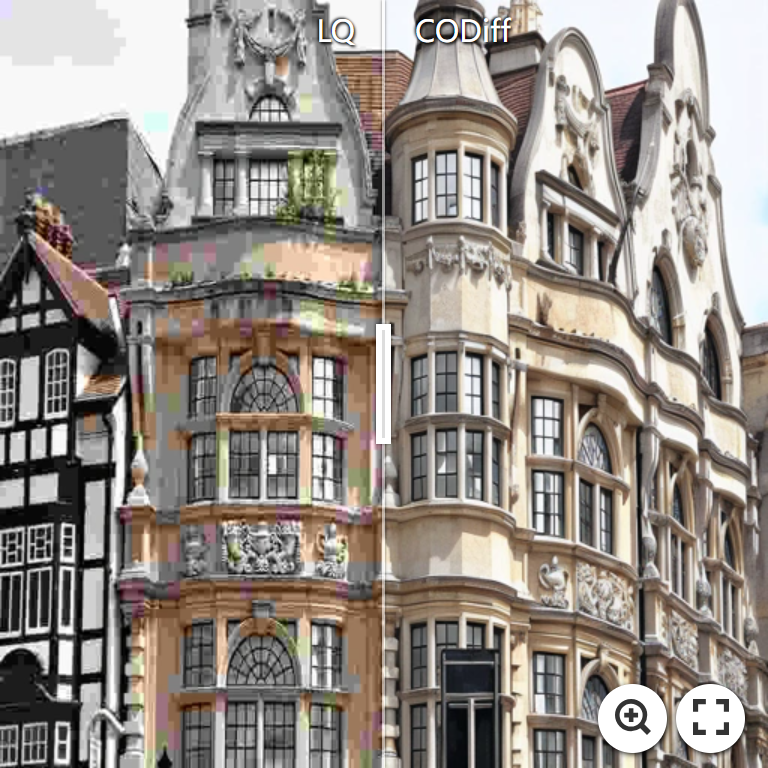](https://imgsli.com/MzQ5Mjk1)

[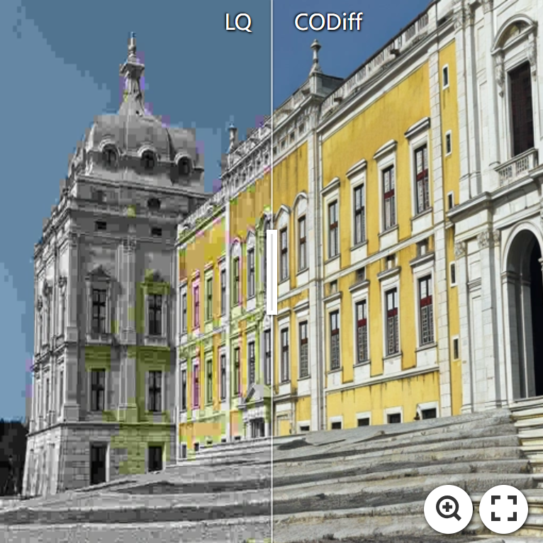](https://imgsli.com/MzQ5Mjk2) [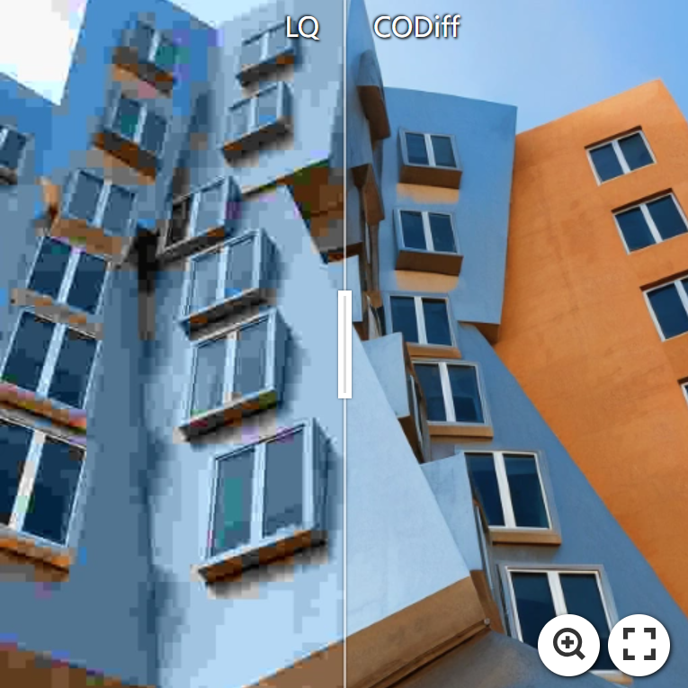](https://imgsli.com/MzQ5Mjk3) [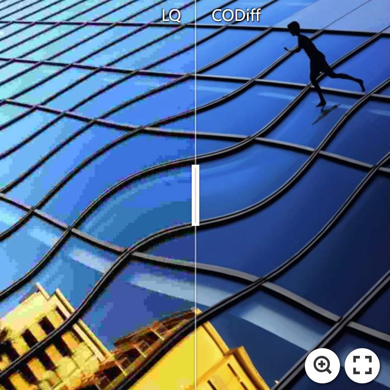](https://imgsli.com/MzQ5MzAx)

[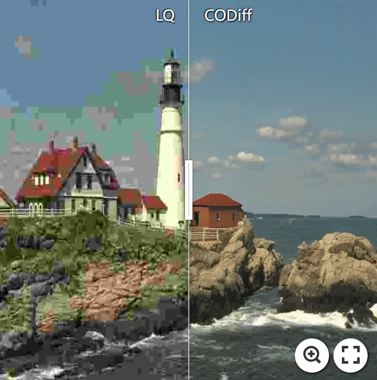](https://imgsli.com/MzQ5MzAy) [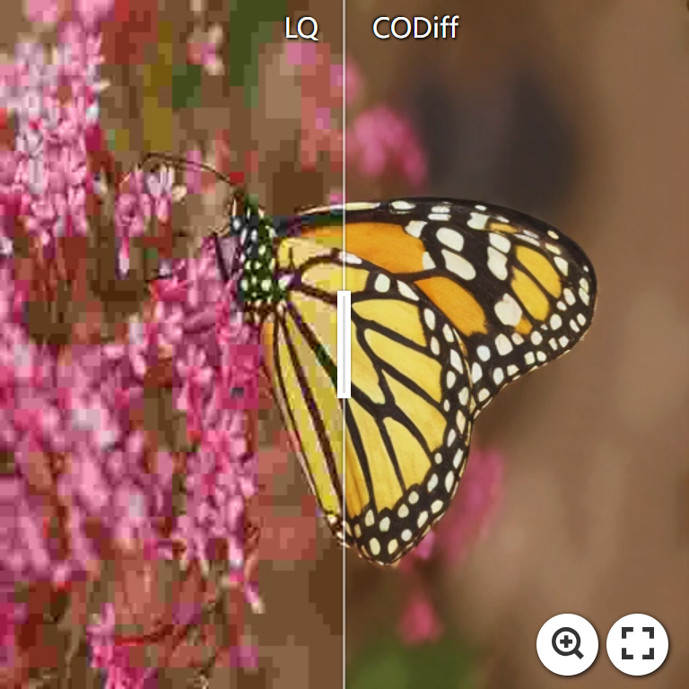](https://imgsli.com/MzQ5MzAz) 

---

## ⚒️ TODO

* [ ] Release code and pretrained models

## 🔗 Contents

- [ ] Datasets
- [ ] Models
- [ ] Testing
- [ ] Training
- [x] [Results](#Results)
- [ ] Citation
- [ ] Acknowledgements

## 🔎 Results

We achieved state-of-the-art performance on LIVE-1, Urban100 and DIV2K-val datasets. Detailed results can be found in the paper.

&ensp;Quantitative Comparisons (click to expand) 

<li> Quantitative results on LIVE-1 dataset from the main paper. 

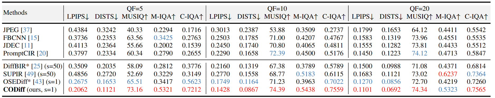

</li>
<li> Quantitative results on Urban100 dataset from the main paper. 

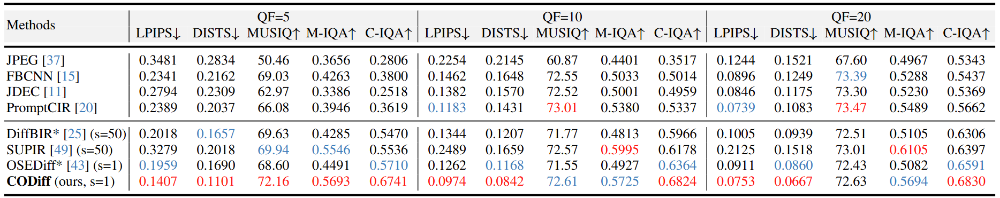

</li>
<li> Quantitative results on DIV2K-val dataset from the main paper. 

</li>

&ensp;Visual Comparisons (click to expand) 

<li> Visual results on LIVE-1 dataset from the main paper.

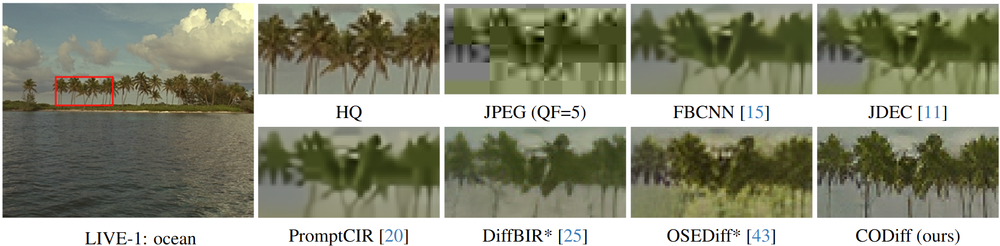

</li>
<li> Visual results on Urban100 dataset from the main paper.

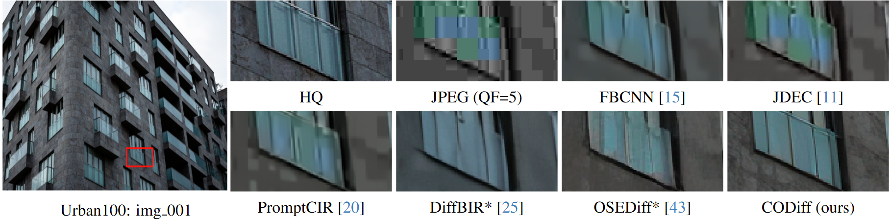

</li>
<li> Results in Figure 6 on real-world dataset (Wider-Test, LFW-Test, WebPhoto-Test) from the main paper.

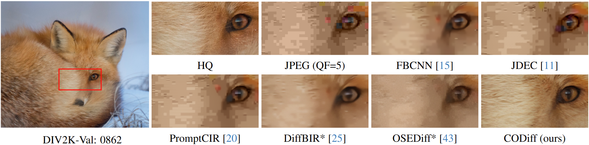

</li>

## 📎 Citation

[TBD]

## 💡 Acknowledgements

[TBD]

<!--  -->